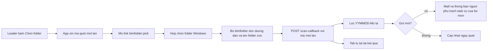

# Kế hoạch QLy HSTK và Dashboard dự án

Bản đọc được trong repo: [.cursor/plans/qly-hstk.plan.md](.cursor/plans/qly-hstk.plan.md).

## Giới hạn cần biết trước

Hồ sơ nằm trên ổ mạng hoặc NAS. App chạy trên Cloudflare nên server **không đọc và không canh** được folder nội bộ. Cách làm:

- **Không dùng hộp chọn folder của trình duyệt** (`showDirectoryPicker`). Chọn và quét folder đều do bộ `bimfolder` cài trên máy làm, bằng hộp chọn folder của Windows Explorer (mục "Bộ bimfolder trên máy" bên dưới).
- Bộ đó đọc được **đường dẫn đầy đủ** (vd `Z:\DuAn\BOD\KT`, cùng ổ map trên mọi máy) và **tên các folder con**, rồi gửi lên server. Leader không phải dán đường dẫn. Không upload file, không đọc nội dung file.
- "Có hồ sơ mới" được phát hiện **khi có người bấm Quét lại**. Không có canh nền 24/7. Muốn tự động hẳn thì sau này cho chính bộ đó chạy theo lịch trên một máy. Đợt này chưa làm.
- Máy chưa cài bộ: chỉ xem được tab, không chọn hay quét được. Ô dán tay danh sách tên folder (vd kết quả `dir /b`) giữ làm đường dự phòng cho `system_admin`.

## Dữ liệu (migration cộng thêm `0063_design_packages`)

- `project_design_disciplines`: `project_id`, `discipline_code` (lấy từ `disciplines.code`), `leader_id`, `folder_path` (chữ, để hiển thị), `last_scanned_at`, `last_scanned_by`. UNIQUE (`project_id`, `discipline_code`).
- `design_packages`: `project_id`, `discipline_code`, `folder_name` (tên gốc), `package_date` (DATE tách từ YYMMDD), `description`, `first_seen_at`, `created_by`. UNIQUE (`project_id`, `discipline_code`, `folder_name`).
- `tasks.design_package_id` INTEGER NULL (ALTER cộng thêm). Task cũ để NULL nên không bị ảnh hưởng.
- `email_settings.notify_design_package` INTEGER DEFAULT 1.
- `design_scan_tokens`: `token_hash`, `user_id`, `project_id`, `discipline_code`, `mode` (`pick` hoặc `rescan`), `expires_at` (10 phút), `used_at`. Mã dùng một lần, chỉ lưu hash.

Luật tách tên: regex `^(\d{6})-(.+)$`, ngày phải hợp lệ (260915 thành 2026-09-15). Tên sai mẫu không lưu, trả về danh sách "bỏ qua" để leader thấy.

## Tab QLy HSTK trong dự án

Thêm nút tab cạnh Tổng hợp CV và Checklist HSTK ([public/index.html](public/index.html) khoảng dòng 3285–3340). Checklist HSTK giữ nguyên.

- Mọi thành viên dự án xem được.
- Khai báo bộ môn và leader: `system_admin` hoặc `project_admin` của dự án (người QLTK).
- Chọn folder và quét: leader của bộ môn đó, hoặc `project_leader` hoặc `project_admin` trở lên.

Mỗi bộ môn là một khối:

- Đầu khối: đường dẫn folder, ngày quét gần nhất, **HSTK mới nhất** (ngày + mô tả), nút Chọn folder / Quét lại.
- Danh sách gói hồ sơ: `YYMMDD`, mô tả, ngày phát hiện.
- Bảng dòng: **hạng mục** (`categories` của dự án) x **file model** (`project_models`) có mã bộ môn trong tên. Tên được tách theo dấu `-`, khớp đúng một đoạn bằng mã bộ môn, không phân biệt hoa thường (vd `BOD-TKCS-ZZ-M3-Nhà làm việc chính-Combine` thuộc bộ môn `ZZ`). Hạng mục gán theo mã hoặc tên hạng mục có trong tên file. Không khớp hạng mục thì vào nhóm "Chưa gán hạng mục".
- Mỗi dòng có: task đang có (người phụ trách, trạng thái, Theo HSTK), cờ đối chiếu, nút **Giao task**.

API mới (đều kiểm tra quyền dự án, không cho `SELECT *`):

- `GET /api/projects/:id/design` trả bộ môn, gói hồ sơ, dòng hạng mục x model, task gắn gói. Gộp bằng vài query, không N+1.
- `PUT /api/projects/:id/design/disciplines` để khai báo bộ môn.
- `POST /api/projects/:id/design/disciplines/:code/scan-token` (đã đăng nhập, cùng quyền quét) cấp mã một lần, trả link `bimfolder:`.
- `POST /api/design/scan-callback` (không Bearer, xác thực bằng mã một lần) nhận `{ token, folder_path, folder_names: string[] }` (tối đa 500 tên). Server kiểm mã chưa hết hạn, chưa dùng, rồi ghi như luật quét bên dưới dưới tên người đã xin mã.
- `POST /api/projects/:id/design/disciplines/:code/scan` với `{ folder_names }`: đường dán tay dự phòng, chỉ `system_admin`.

## Bộ bimfolder trên máy (chọn, quét, mở folder)

Chrome và Edge không cho trang https mở `Z:\...` hay `file://`, cũng không cho biết đường dẫn thật. Mọi máy map NAS vào cùng một ổ, nên dùng một giao thức riêng `bimfolder:` cài một lần mỗi máy. Trình duyệt chỉ chuyển link, mọi việc với folder do Explorer và script trên máy làm.

Ba lệnh, không có lệnh khác:

- `bimfolder:pick?token=…&api=…` (nút **Chọn folder**): mở hộp chọn folder của Windows, bắt đầu từ gốc NAS. Chọn xong, script đọc đường dẫn và tên folder con cấp một, rồi gọi `scan-callback`. Đóng hộp mà không chọn thì không gửi gì.
- `bimfolder:scan?token=…&api=…&path=…` (nút **Quét lại**): không mở hộp chọn, đọc lại folder con của đường dẫn đã lưu rồi gọi `scan-callback`.
- `bimfolder:open?path=…` (link đường dẫn bộ môn hoặc gói hồ sơ): mở Explorer đúng folder. Link gói = đường dẫn bộ môn + `\` + `folder_name`.

Sau khi bấm Chọn folder hoặc Quét lại, tab hiện "Đang chờ quét trên máy…" và hỏi server vài lần trong tối đa 2 phút tới khi mã đã dùng, rồi tải lại kết quả (gói mới, tên bị bỏ qua). Lần đầu trình duyệt hỏi "Mở ứng dụng?", tick luôn cho phép.

An toàn:

- `system_admin` khai báo **gốc NAS** (vd `Z:\DuAn`) trong cấu hình hệ thống sẵn có. Script và server đều từ chối đường dẫn ngoài gốc hoặc có `..`.
- Script không chạy file, chỉ gọi `explorer.exe` tới folder có thật. Chỉ gửi dữ liệu tới đúng địa chỉ app ghi sẵn lúc cài, không lấy theo `api` trong link.
- Mã quét dùng một lần, hết hạn sau 10 phút, gắn với đúng người, dự án và bộ môn. Không đưa JWT đăng nhập vào link.

Bộ cài trong repo, IT phát cho từng máy (tay hoặc GPO): `tools/bimfolder/install-bimfolder.reg` đăng ký `HKCU\Software\Classes\bimfolder`, gọi `bimfolder.ps1`, kèm file gỡ cài và hướng dẫn cài ngắn bằng tiếng Việt.

Trình duyệt không biết máy đã cài hay chưa. Cạnh link mở folder có biểu tượng copy nhỏ. Quét chờ quá 2 phút thì tab báo "Máy chưa cài bimfolder?" kèm link hướng dẫn.

Link mở folder hiện ở tab QLy HSTK, trên mail hồ sơ mới (người nhận bấm là mở folder gói mới) và trên Dashboard dự án cạnh ngày HSTK mới nhất.

## Giao task

Nút Giao task mở **modal task đang có** (không làm modal mới), điền sẵn: Loại task = mô hình, dự án, bộ môn, hạng mục, filename, `design_package_id` = gói mới nhất của bộ môn. Người dùng chỉ chọn giai đoạn, người phụ trách, hạn và thông tin kèm theo.

- Ô **Theo HSTK nào** (`hstk_date`) là combobox gợi ý các gói của bộ môn, vẫn cho gõ tay. Chọn từ danh sách thì đối chiếu mới chắc.
- Ghi qua `POST /api/tasks` hiện có ([src/index.tsx](src/index.tsx) khoảng dòng 2826), thêm nhận `design_package_id`. Quyền tạo task không đổi.
- Nút Giao task chỉ hiện với người `isProjectLeaderOrAdmin`. Thành viên thường vẫn tự tạo task như cũ.

## Bắt buộc Theo HSTK

Chỉ với task có `design_package_id`:

- `POST /api/tasks` và `PUT /api/tasks/:id` (khoảng dòng 2970) trả 422 "Phải điền Theo HSTK nào" nếu `hstk_date` sau cập nhật bị trống. Chặn ở server, UI chỉ hiện nhắc lỗi.
- Task không gắn gói giữ luật hiện tại, không bắt buộc.

Đối chiếu (server tính, trả trong API):

- **Đúng HS mới nhất**: `hstk_date` trùng tên gói mới nhất của bộ môn.
- **Chậm HS**: trùng một gói cũ hơn, hoặc gói phát sinh task không còn là gói mới nhất.
- **Chưa đối chiếu**: gõ tay không khớp gói nào.

## Mail khi có hồ sơ mới

Trong route scan, khi có gói mới:

- Người nhận: người phụ trách các task của **cùng dự án + bộ môn** có `design_package_id` khác NULL và chưa `completed`.
- Mỗi người **một mail cho một lần quét**, liệt kê các gói mới và task liên quan. Dùng `sendEmail` với event mới `design_package_new`, tôn trọng `notify_design_package`. Kèm một thông báo trong app.
- Quét lại không có gói mới thì không gửi.

## Dashboard dự án (trang mới ngay sau Dashboard)

Mục menu "Dashboard dự án" đặt ngay dưới Dashboard ([public/index.html](public/index.html) khoảng dòng 2024). Mọi vai trò đều vào được. Mỗi người chỉ thấy dự án mình thuộc, `system_admin` thấy hết. **Không hiện tiền** (giá trị HĐ, doanh thu, chi phí).

`GET /api/project-dashboard`, một lần gọi, query gộp theo dự án:

- Mỗi dự án một dòng hoặc thẻ: trạng thái, tiến độ (dùng cách tính đã có), task trễ, task mở, ngày HSTK mới nhất theo từng bộ môn.
- **Đang vướng gì** (server tính từ dữ liệu, không nhập tay): có task trễ; bộ môn chưa quét quá 14 ngày; hạng mục chưa có task theo gói mới nhất; task Chậm HS; bộ môn đã khai báo nhưng chưa có gói.
- Bấm vào dự án thì mở bảng **nhà / hạng mục x gói mới nhất**: đã cập nhật (task theo gói đó đã xong), đang làm, chưa giao.
- Lọc theo trạng thái dự án và theo "chỉ dự án đang vướng".

## Gợi ý thêm cho QLTK (đợt 2, cột cộng thêm trên `design_packages`)

Sửa ngay trên dòng gói hồ sơ trong tab QLy HSTK, quyền như quét:

- Loại gói: phát hành, sửa đổi, phản hồi góp ý.
- Giai đoạn hồ sơ (TKCS, TKKT, BVTC), để nối với Checklist HSTK sẵn có.
- Lần sửa (R0, R1...).
- Trạng thái soát xét: chờ soát, đã góp ý, chấp thuận. Hạn phản hồi.
- Nguồn: TVTK, CĐT, nội bộ.
- Liên kết văn bản giao nhận trong Hồ sơ pháp lý (số văn bản đến/đi).

Các cột này là tuỳ chọn và không làm đổi luật đợt 1. Dashboard có thể thêm cờ "gói quá hạn phản hồi" khi có cột hạn.

## Không làm

- Đổi quyền tạo hoặc sửa task hiện tại, ngoài luật bắt buộc Theo HSTK cho task gắn gói
- Upload file hồ sơ lên R2, hoặc đọc nội dung file
- Canh folder nền trên server
- Dùng hộp chọn folder của trình duyệt (`showDirectoryPicker`, `webkitdirectory`)
- Đưa số tiền vào Dashboard dự án
- Sửa Checklist HSTK, `app.v2.js`

## Kiểm tra

- Quét hai lần cùng danh sách: lần 2 không tạo gói trùng, không gửi mail.
- Tên `260915-Phát hành TKCS` lưu thành 2026-09-15 và "Phát hành TKCS". Tên `abc` hoặc `261345-x` bị bỏ qua.
- Member không phải leader gọi scan hoặc khai báo bộ môn thì 403.
- Task gắn gói, xoá Theo HSTK thì 422. Task cũ xoá được như trước.
- Member dự án A không thấy dự án B trên Dashboard dự án, và không có trường tiền trong response.
- Máy đã cài `bimfolder`: bấm Chọn folder thì hộp chọn Windows mở ở gốc NAS; chọn xong tab tự hiện gói mới, đường dẫn lưu đúng `Z:\...`.
- Bấm link gói thì Explorer mở đúng folder. Link sửa tay trỏ ra ngoài gốc NAS, hoặc tới file `.exe`, thì script từ chối, không mở gì.
- Gửi lại cùng mã quét lần 2, hoặc sau 10 phút, thì server từ chối. Mã của bộ môn A không ghi được vào bộ môn B.