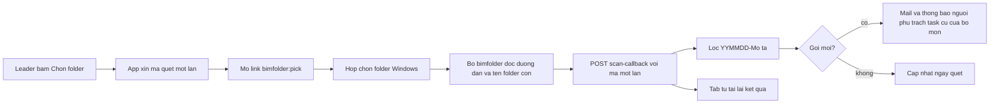

# Kế hoạch QLy HSTK và Dashboard dự án

Bản đọc được trong repo: [.cursor/plans/qly-hstk.plan.md](.cursor/plans/qly-hstk.plan.md).

## Giới hạn cần biết trước

Hồ sơ nằm trên ổ mạng hoặc NAS. App chạy trên Cloudflare nên server **không đọc và không canh** được folder nội bộ. Cách làm:

- **Không dùng hộp chọn folder của trình duyệt** (`showDirectoryPicker`). Chọn và quét folder đều do bộ `bimfolder` cài trên máy làm, bằng hộp chọn folder của Windows Explorer (mục "Bộ bimfolder trên máy" bên dưới).
- Bộ đó đọc được **đường dẫn đầy đủ** (vd `Z:\DuAn\BOD\KT`, cùng ổ map trên mọi máy) và **tên các folder con**, rồi gửi lên server. Leader không phải dán đường dẫn. Không upload file, không đọc nội dung file.
- "Có hồ sơ mới" được phát hiện **khi có người bấm Quét lại**. Không có canh nền 24/7. Muốn tự động hẳn thì sau này cho chính bộ đó chạy theo lịch trên một máy. Đợt này chưa làm.
- Máy chưa cài bộ: chỉ xem được tab, không chọn hay quét được. Ô dán tay danh sách tên folder (vd kết quả `dir /b`) giữ làm đường dự phòng cho `system_admin`.

## Dữ liệu (migration cộng thêm `0064_design_packages`)

Số migration lấy theo file mới nhất trong `migrations/` lúc bắt đầu code (hiện là `0063_legal_package_contract_signed.sql`). Nếu đã có `0064` thì dùng số kế tiếp.

- `project_design_disciplines`: `project_id`, `discipline_code` (lấy từ `disciplines.code`), `role_codes` (mã Vai trò/Bộ môn theo BEP, cách nhau dấu phẩy, mặc định bằng `discipline_code`), `leader_id`, `folder_path` (chữ, để hiển thị), `last_scanned_at`, `last_scanned_by`. UNIQUE (`project_id`, `discipline_code`).
- `design_packages`: `project_id`, `discipline_code`, `folder_name` (tên gốc), `package_date` (DATE tách từ YYMMDD), `description`, `first_seen_at`, `created_by`, `missing_since` (NULL khi folder còn trên NAS). UNIQUE (`project_id`, `discipline_code`, `folder_name`). Thêm các cột thông tin gói (mục "Thông tin gói hồ sơ"):
  - `package_type`: `issue` (phát hành), `revise` (sửa đổi), `response` (phản hồi góp ý)
  - `doc_stage`: `TKCS`, `TKKT`, `BVTC`
  - `revision_label` (sửa tay, NULL thì dùng số tự đánh)
  - `review_status`: `pending` (chờ soát), `commented` (đã góp ý), `approved` (chấp thuận)
  - `review_due_date`
  - `source`: `TVTK`, `CDT`, `internal`
  - `outgoing_letter_id` (NULL, trỏ `outgoing_letters`)
  - `updated_by`, `updated_at`
- `design_scan_log`: `project_id`, `discipline_code`, `scanned_by`, `scanned_at`, `new_count`, `missing_count`, `total_count`. Mỗi lần quét một dòng, để xem lịch sử thay đổi. Không ghi log theo từng request khác.
- `tasks.design_package_id` INTEGER NULL (ALTER cộng thêm). Task cũ để NULL nên không bị ảnh hưởng.
- `email_settings.notify_design_package` INTEGER DEFAULT 1.
- `design_scan_tokens`: `token_hash`, `user_id`, `project_id`, `discipline_code`, `mode` (`pick` hoặc `rescan`), `expires_at` (10 phút), `used_at`. Mã dùng một lần, chỉ lưu hash.

Luật tách tên: regex `^(\d{6})-(.+)$`, ngày phải hợp lệ (260915 thành 2026-09-15). Tên sai mẫu không lưu, trả về danh sách "bỏ qua" để leader thấy.

## Revision (số lần sửa đổi)

Mỗi lần quét có folder `YYMMDD-Mô tả` mới là bộ môn có thêm một revision.

- **Số tự đánh**: trong cùng dự án + bộ môn, xếp các gói theo `package_date` rồi `folder_name`. Gói đầu là `R0`, gói kế là `R1`… Tính khi đọc bằng `ROW_NUMBER()`, không lưu cứng, để gói bổ sung ngày cũ vẫn đúng thứ tự.
- **Nhãn hiển thị** = `revision_label` nếu QLTK sửa tay (vd `R2a`), ngược lại dùng số tự đánh.
- **Số lần sửa đổi** của bộ môn = số gói trừ một (R0 là phát hành đầu, chưa phải lần sửa).
- **Folder bị xoá hoặc đổi tên trên NAS**: lần quét không thấy nữa thì ghi `missing_since`, gói vẫn giữ, hiện nhãn "Không còn trên NAS". Không xoá task đã gắn gói đó. Thấy lại thì bỏ `missing_since`.
- Mỗi lần quét ghi một dòng `design_scan_log` (thêm bao nhiêu, mất bao nhiêu, tổng). Quét không thay đổi gì vẫn ghi, để biết đã có người kiểm tra.

Hạng mục theo revision: mỗi hạng mục trong bộ môn có **revision đã cập nhật** = revision của gói mới nhất mà hạng mục đó có task gắn gói đã `completed`. So với revision hiện tại của bộ môn thì ra **chậm N revision** (vd hiện tại R3, nhà A mới xong theo R1 thì chậm 2).

## Tab QLy HSTK trong dự án

Thêm nút tab cạnh Tổng hợp CV và Checklist HSTK ([public/index.html](public/index.html) khoảng dòng 3285–3340). Checklist HSTK giữ nguyên.

- Mọi thành viên dự án xem được.
- Khai báo bộ môn và leader: `system_admin` hoặc `project_admin` của dự án (người QLTK).
- Chọn folder và quét: leader của bộ môn đó, hoặc `project_leader` hoặc `project_admin` trở lên.

Mỗi bộ môn là một khối:

- Đầu khối: đường dẫn folder, ngày quét gần nhất, **HSTK mới nhất** (ngày + mô tả), **revision hiện tại** (vd `R3`), **số lần sửa đổi** (vd 3 lần), nút Chọn folder / Quét lại / Lịch sử quét.
- Danh sách gói hồ sơ, mới nhất ở trên. Cột: Rev, ngày `YYMMDD`, mô tả, loại gói, giai đoạn, nguồn, trạng thái soát xét, hạn phản hồi, văn bản giao nhận, số task gắn gói (xong/tổng), ngày phát hiện, link mở folder. Gói có `missing_since` hiện mờ kèm nhãn.
- Lịch sử quét: bảng nhỏ từ `design_scan_log` (ngày, người quét, thêm, mất, tổng).
- Bảng dòng: **hạng mục** (`categories` của dự án) x **file model** (`project_models`), tách tên theo quy tắc đặt tên file trong BEP (mục "Quy tắc tên file theo BEP" bên dưới). Dòng thuộc bộ môn khi trường **Vai trò/Bộ môn** nằm trong `role_codes`. Hạng mục là trường **Khối tích**, khớp với `categories.code`.
- Nhóm cuối khối: "Chưa gán hạng mục" (Khối tích `ZZ`/`XX` hoặc chưa có hạng mục trùng mã) và "Sai quy tắc đặt tên" (tên không tách được). Nhóm sai quy tắc hiện ở một chỗ chung, để QLTK sửa tên trong Danh sách model. Không đoán lỏng theo chữ có trong tên như trước.

## Quy tắc tên file theo BEP

Nguồn: `Z:\0 - Document\01 BEP\Prj-One-ZZ-ZZ-BEP-ZZ-0002_PL1-Các quy định triển khai BIM.docx`, mục 1.2. Các trường cách nhau dấu `-`:

`Mã dự án - Đơn vị khởi tạo - Khối tích - Cao trình - Loại - Vai trò/Bộ môn - Số thứ tự [- Mô tả] [- Trạng thái] [- Phiên bản]`

Ví dụ: `TT09-OAD-HZ-BF-M3-A-0001-HAM TT` là mô hình 3D, bộ môn Kiến trúc sư, khối Hầm tổng thể.

Một hàm server `parseBepFileName(name)` (một chỗ, có unit test) trả `{ project, originator, volume, level, type, role, number, description }` hoặc lỗi:

- Cần ít nhất 7 trường. Trường 7 là 4–6 chữ số (`0001`). Phần sau trường 7 gộp lại thành mô tả, trạng thái và phiên bản chưa tách ở đợt này.
- So sánh không phân biệt hoa thường, bỏ khoảng trắng hai đầu. Có đuôi `.rvt`, `.nwc`, `.ifc`… thì bỏ đuôi trước khi tách.
- Trường Loại hiện thành cột (`M3`, `M2`, `CM`, `DR`…). Giao task mặc định Loại task = mô hình khi Loại là `M2`, `M3`, `CM`.
- Mã dự án trong tên khác mã dự án trong app thì không chặn, chỉ gắn cờ nhỏ "Mã dự án khác".

Mã bộ môn BEP khớp với `disciplines.code` của app, trừ hai chỗ. Hai chỗ này khai báo qua `role_codes`, không đổi bảng `disciplines`:

- BEP dùng `EM` cho Điều hòa thông gió, app đã đổi thành `HVAC` (migration `0012`). Khối HVAC khai báo `role_codes = HVAC,EM`.
- BEP có mã nhóm `A` (Kiến trúc sư), `E`, `C`, `L`, `MEP`. Muốn khối Kiến trúc nhận cả file mã `A` thì khai báo `role_codes = AA,A`.

Folder gói hồ sơ vẫn theo mẫu `YYMMDD-Mô tả` đã chốt, tách riêng khỏi quy tắc tên file ở trên.
- Mỗi dòng có: task đang có (người phụ trách, trạng thái, Theo HSTK), cờ đối chiếu, **revision đã cập nhật / hiện tại** (vd `R1 / R3`, chậm 2), nút **Giao task**.

API mới (đều kiểm tra quyền dự án, không cho `SELECT *`):

- `GET /api/projects/:id/design` trả bộ môn, gói hồ sơ, dòng hạng mục x model, task gắn gói. Gộp bằng vài query, không N+1.
- `PUT /api/projects/:id/design/disciplines` để khai báo bộ môn.
- `POST /api/projects/:id/design/disciplines/:code/scan-token` (đã đăng nhập, cùng quyền quét) cấp mã một lần, trả link `bimfolder:`.
- `POST /api/design/scan-callback` (không Bearer, xác thực bằng mã một lần) nhận `{ token, folder_path, folder_names: string[] }` (tối đa 500 tên). Server kiểm mã chưa hết hạn, chưa dùng, rồi ghi như luật quét bên dưới dưới tên người đã xin mã.
- `POST /api/projects/:id/design/disciplines/:code/scan` với `{ folder_names }`: đường dán tay dự phòng, chỉ `system_admin`.

## Bộ bimfolder trên máy (chọn, quét, mở folder)

Chrome và Edge không cho trang https mở `Z:\...` hay `file://`, cũng không cho biết đường dẫn thật. Mọi máy map NAS vào cùng một ổ, nên dùng một giao thức riêng `bimfolder:` cài một lần mỗi máy. Trình duyệt chỉ chuyển link, mọi việc với folder do Explorer và script trên máy làm.

Ba lệnh, không có lệnh khác:

- `bimfolder:pick?token=…&api=…` (nút **Chọn folder**): mở hộp chọn folder của Windows, bắt đầu từ gốc NAS. Chọn xong, script đọc đường dẫn và tên folder con cấp một, rồi gọi `scan-callback`. Đóng hộp mà không chọn thì không gửi gì.
- `bimfolder:scan?token=…&api=…&path=…` (nút **Quét lại**): không mở hộp chọn, đọc lại folder con của đường dẫn đã lưu rồi gọi `scan-callback`.
- `bimfolder:open?path=…` (link đường dẫn bộ môn hoặc gói hồ sơ): mở Explorer đúng folder. Link gói = đường dẫn bộ môn + `\` + `folder_name`.

Sau khi bấm Chọn folder hoặc Quét lại, tab hiện "Đang chờ quét trên máy…" và hỏi server vài lần trong tối đa 2 phút tới khi mã đã dùng, rồi tải lại kết quả (gói mới, tên bị bỏ qua). Lần đầu trình duyệt hỏi "Mở ứng dụng?", tick luôn cho phép.

An toàn:

- `system_admin` khai báo **gốc NAS** (vd `Z:\DuAn`) trong cấu hình hệ thống sẵn có. Script và server đều từ chối đường dẫn ngoài gốc hoặc có `..`.
- Script không chạy file, chỉ gọi `explorer.exe` tới folder có thật. Chỉ gửi dữ liệu tới đúng địa chỉ app ghi sẵn lúc cài, không lấy theo `api` trong link.
- Mã quét dùng một lần, hết hạn sau 10 phút, gắn với đúng người, dự án và bộ môn. Không đưa JWT đăng nhập vào link.

Bộ cài trong repo, IT phát cho từng máy (tay hoặc GPO): `tools/bimfolder/install-bimfolder.reg` đăng ký `HKCU\Software\Classes\bimfolder`, gọi `bimfolder.ps1`, kèm file gỡ cài và hướng dẫn cài ngắn bằng tiếng Việt.

Trình duyệt không biết máy đã cài hay chưa. Cạnh link mở folder có biểu tượng copy nhỏ. Quét chờ quá 2 phút thì tab báo "Máy chưa cài bimfolder?" kèm link hướng dẫn.

Link mở folder hiện ở tab QLy HSTK, trên mail hồ sơ mới (người nhận bấm là mở folder gói mới) và trên Dashboard dự án cạnh ngày HSTK mới nhất.

## Giao task

Nút Giao task mở **modal task đang có** (không làm modal mới), điền sẵn: Loại task = mô hình, dự án, bộ môn, hạng mục, filename, `design_package_id` = gói mới nhất của bộ môn. Người dùng chỉ chọn giai đoạn, người phụ trách, hạn và thông tin kèm theo.

- Ô **Theo HSTK nào** (`hstk_date`) là combobox gợi ý các gói của bộ môn, vẫn cho gõ tay. Chọn từ danh sách thì đối chiếu mới chắc.
- Ghi qua `POST /api/tasks` hiện có ([src/index.tsx](src/index.tsx) khoảng dòng 2826), thêm nhận `design_package_id`. Quyền tạo task không đổi.
- Nút Giao task chỉ hiện với người `isProjectLeaderOrAdmin`. Thành viên thường vẫn tự tạo task như cũ.

## Bắt buộc Theo HSTK

Chỉ với task có `design_package_id`:

- `POST /api/tasks` và `PUT /api/tasks/:id` (khoảng dòng 2970) trả 422 nếu `hstk_date` sau cập nhật bị trống, body `{ error: "Phải điền Theo HSTK nào", field: "hstk_date", required_fields: ["hstk_date"] }`. Luật chặn nằm ở server.
- Task không gắn gói giữ luật hiện tại, không bắt buộc.

Báo cho người dùng đúng ô cần điền, trước và sau khi lưu:

- **Trước khi lưu**: task có `design_package_id` thì ô Theo HSTK nào có dấu `*` đỏ ở nhãn, viền nhấn, và dòng gợi ý dưới ô "Bắt buộc với task tạo từ hồ sơ `<tên gói>`". Áp ở modal task (`taskHstkDate`) và ô `data-tfield="hstk_date"` trong bảng task. Placeholder đổi thành "Bắt buộc: chọn gói HSTK…".
- **Bấm Lưu khi ô trống** (kiểm trước ở trình duyệt, để khỏi gọi API): không gửi, cuộn tới ô, focus vào ô, viền đỏ và chữ lỗi ngay dưới ô "Phải điền Theo HSTK nào để so sánh với hồ sơ phát sinh task". Toast chỉ là phụ.
- **Server vẫn trả 422** (vd sửa từ bảng task, đổi trạng thái nhanh, hoặc chỗ gọi khác): app đọc `field` trong body. Đang ở modal thì đánh dấu và focus ô như trên. Đang ở bảng task thì tô đỏ ô Theo HSTK của đúng dòng, focus ô, rồi khôi phục giá trị đã thử sửa. Chỗ không có ô (vd đổi trạng thái nhanh từ nút) thì mở modal task, tự focus ô Theo HSTK kèm thông báo.
- Điền xong thì bỏ viền đỏ và chữ lỗi ngay khi gõ hoặc chọn gói.
- Cùng một hàm phía trình duyệt (vd `markRequiredField(container, field, message)`) cho cả modal và bảng task, không viết riêng từng chỗ. Màu lấy theo token sáng/tối sẵn có.

Đối chiếu (server tính, trả trong API):

- **Đúng HS mới nhất**: `hstk_date` trùng tên gói mới nhất của bộ môn.
- **Chậm HS**: trùng một gói cũ hơn, hoặc gói phát sinh task không còn là gói mới nhất.
- **Chưa đối chiếu**: gõ tay không khớp gói nào.

## Mail khi có hồ sơ mới

Trong route scan, khi có gói mới:

- Người nhận: người phụ trách các task của **cùng dự án + bộ môn** có `design_package_id` khác NULL và chưa `completed`.
- Mỗi người **một mail cho một lần quét**, liệt kê các gói mới (kèm revision, vd "KT lên R3"), các task liên quan, và link mở folder gói. Dùng `sendEmail` với event mới `design_package_new`, tôn trọng `notify_design_package`. Kèm một thông báo trong app.
- Quét lại không có gói mới thì không gửi.

## Dashboard dự án (trang mới ngay sau Dashboard)

Mục menu "Dashboard dự án" đặt ngay dưới Dashboard ([public/index.html](public/index.html) khoảng dòng 2024). **Toàn thể nhân sự** đã đăng nhập (mọi vai trò) thấy **mọi dự án** để cùng theo dõi, không lọc theo thành viên dự án.

Đây là ngoại lệ có chủ đích so với luật "dữ liệu dự án lọc theo thành viên", nên giữ trong khung hẹp:

- Chỉ đọc, chỉ số liệu tổng hợp. Không có nút sửa, không giao task từ trang này. Ngoại lệ duy nhất: tên task trong bộ lọc thành viên (mục bên dưới) cho người có quyền, và bấm vào thì mở modal task đang có.
- Response chỉ gồm các trường trong **danh sách cho phép**: mã, tên, trạng thái, giai đoạn, tiến độ, số task mở/trễ, ngày HSTK mới nhất theo bộ môn, revision hiện tại và số lần sửa đổi, dòng thời gian gói (ngày, mô tả, loại, giai đoạn, nguồn, trạng thái soát xét, hạn phản hồi, số văn bản giao nhận), trạng thái và revision đã cập nhật của từng hạng mục, danh sách "đang vướng", tên leader bộ môn.
- **Không có tiền** (giá trị HĐ, doanh thu, chi phí, phí QL), không lương, không nội dung chat.
- Tên task: chỉ người có **quyền xem task** (mục bên dưới) mới nhận được. Member thường chỉ thấy số.

### Quyền xem task trên dashboard

Người có vai trò app (`users.role`) là `system_admin`, `project_admin` hoặc `project_leader` thấy **mọi dự án và mọi task** trên dashboard, kể cả dự án mình không phải leader hay thành viên. Luật này khớp với `isProjectLeaderOrAdmin` trong [src/index.tsx](src/index.tsx) (khoảng dòng 3209), vốn đã trả `true` cho ba vai trò này ở mọi dự án. Không viết kiểm tra quyền mới, dùng lại hàm đó.

Member thường (`users.role = member`):

- Thấy tên task của chính mình.
- Thấy tên task ở dự án mình là leader hoặc admin theo vai trò trong dự án (`project_members` hay `projects.leader_id`/`admin_id`). Vẫn qua `isProjectLeaderOrAdmin`.
- Dự án còn lại: chỉ thấy số.

Áp ở hai chỗ:

- Bấm vào một dự án: ngoài bảng nhà x gói mới nhất, người có quyền xem task thấy thêm danh sách task chưa hoàn thành của dự án đó (tên, bộ môn, hạng mục, người phụ trách, hạn, trạng thái, Theo HSTK).
- Bộ lọc thành viên (mục bên dưới).

Bấm tên task thì mở modal task đang có. `PUT /api/tasks/:id` đã cho ba vai trò trên sửa mọi task, nên không cần mở thêm quyền.
- Link mở folder `bimfolder:` vẫn hiện, vì mọi máy đều có quyền ổ NAS chung.
- Bấm "Mở dự án" thì đi tới chi tiết dự án như cũ. Người không phải thành viên vẫn bị route chi tiết chặn, trang này không mở rộng quyền đó.

`GET /api/project-dashboard`, một lần gọi, query gộp theo dự án:

- Mỗi dự án một dòng hoặc thẻ: trạng thái, tiến độ (dùng cách tính đã có), task trễ, task mở, ngày HSTK mới nhất theo từng bộ môn, **revision hiện tại và số lần sửa đổi** theo từng bộ môn (vd `KT R3 · 3 lần`), tổng số lần sửa đổi của dự án, ngày thay đổi gần nhất.
- **Đang vướng gì** (server tính từ dữ liệu, không nhập tay): có task trễ; bộ môn chưa quét quá 14 ngày; hạng mục chưa có task theo gói mới nhất; hạng mục chậm từ 1 revision; task Chậm HS; bộ môn đã khai báo nhưng chưa có gói; gói quá hạn phản hồi; gói không còn trên NAS.
- Bấm vào dự án thì mở bảng **nhà / hạng mục x bộ môn**: mỗi ô là revision đã cập nhật / hiện tại (vd `R1 / R3`), màu theo trạng thái: đã cập nhật theo gói mới nhất, đang làm, chưa giao, chậm N revision.
- Kèm dòng thời gian revision của từng bộ môn: các gói theo ngày, loại gói, trạng thái soát xét. Nhìn vào là biết bộ môn nào sửa nhiều, sửa dồn vào lúc nào.
- Lọc theo trạng thái dự án và theo "chỉ dự án đang vướng".

### Lọc theo thành viên

Combobox "Thành viên" (người dùng đang hoạt động). Chọn một người thì danh sách dự án chỉ còn các dự án người đó tham gia, và hiện thêm một khối **tải việc**, để phân bổ task mới hoặc điều chỉnh.

Mọi người thấy phần số liệu của khối tải việc:

- Số dự án đang tham gia (`project_members`, cộng dự án người đó là admin hoặc leader), và số dự án đang có task mở của người đó.
- Task chưa hoàn thành (`assigned_to` = người đó, status khác `completed`). Tách riêng `review` là "chờ duyệt", vì `review` đã được tính là xong phần việc ở `PUT /api/tasks/:id`.
- Task trễ (cùng điều kiện trễ đang dùng ở productivity), hạn gần nhất, tổng giờ dự kiến của task mở.
- Chia theo từng dự án: mỗi dự án bao nhiêu task mở và bao nhiêu task trễ.

Tên task (danh sách task chưa hoàn thành: tên, dự án, bộ môn, hạn, trạng thái, tiến độ) theo mục "Quyền xem task trên dashboard":

- Vai trò app `system_admin`, `project_admin`, `project_leader`: thấy hết tên task của người được chọn, ở mọi dự án.
- Chính người được chọn: thấy hết task của mình.
- Member thường: chỉ thấy tên task ở dự án mình là leader hoặc admin theo vai trò trong dự án. Dự án khác chỉ hiện số.

Server lọc quyền này, không ẩn ở trình duyệt. Ba vai trò trên thì không cần lọc. Member thường thì một query lấy dự án mình quản lý, rồi một query task lọc theo danh sách đó, không lặp từng task.

Điều chỉnh: bấm tên task thì mở **modal task đang có**. Đổi người phụ trách, hạn hay trạng thái đều theo quyền của `PUT /api/tasks/:id` như hiện tại, kể cả luật bắt buộc Theo HSTK với task gắn gói. Dashboard không có đường sửa riêng. Lưu xong thì khối tải việc tự tải lại.

API:

- `GET /api/project-dashboard?member_id=` trả danh sách dự án đã lọc theo người đó, kèm số liệu tải việc. Mọi người dùng đã đăng nhập đều gọi được.
- `GET /api/project-dashboard/members/:id/tasks` trả tên task theo luật quyền ở trên, phần không được xem chỉ có số đếm theo dự án.

## Thông tin gói hồ sơ (đưa vào đợt này)

Sửa ngay trên dòng gói trong tab QLy HSTK, quyền như quét (leader bộ môn, `project_leader`, `project_admin` trở lên). Member chỉ xem.

- **Loại gói**: phát hành, sửa đổi, phản hồi góp ý. Mặc định: gói đầu của bộ môn là phát hành, gói sau là sửa đổi.
- **Giai đoạn hồ sơ**: TKCS, TKKT, BVTC. Mặc định lấy theo giai đoạn dự án nếu khớp. Dùng để lọc, và để sau này nối với Checklist HSTK. Đợt này không sửa Checklist HSTK.
- **Lần sửa**: nhãn revision sửa tay (`revision_label`), để trống thì dùng số tự đánh.
- **Trạng thái soát xét**: chờ soát (mặc định khi mới phát hiện), đã góp ý, chấp thuận. **Hạn phản hồi**: ngày.
- **Nguồn**: TVTK, CĐT, nội bộ.
- **Văn bản giao nhận**: chọn một văn bản trong Văn bản gửi đi (`outgoing_letters`) của cùng dự án. Chỉ hiện số văn bản và ngày, không hiện nội dung. Server kiểm tra văn bản thuộc đúng dự án.

API: `PUT /api/projects/:id/design/packages/:pkgId` với các trường trên. Server kiểm giá trị trong danh sách cho phép, ghi `updated_by`/`updated_at`.

Dùng trên dashboard: cờ **gói quá hạn phản hồi** (`review_due_date` < hôm nay và chưa `approved`), và số gói đang chờ soát.

## Không làm

- Đổi quyền tạo hoặc sửa task hiện tại, ngoài luật bắt buộc Theo HSTK cho task gắn gói
- Upload file hồ sơ lên R2, hoặc đọc nội dung file
- Canh folder nền trên server
- Dùng hộp chọn folder của trình duyệt (`showDirectoryPicker`, `webkitdirectory`)
- Đưa số tiền vào Dashboard dự án
- Sửa Checklist HSTK, `app.v2.js`

## Kiểm tra

- `TT09-OAD-HZ-BF-M3-A-0001-HAM TT` tách ra khối `HZ`, loại `M3`, bộ môn `A`, số `0001`, mô tả `HAM TT`. `BOD-TKCS-ZZ-M3-Nhà làm việc chính-Combine` vào nhóm "Sai quy tắc đặt tên" (trường 7 không phải số).
- File `…-EM-0003` hiện trong khối HVAC khi `role_codes` có `EM`.
- Quét hai lần cùng danh sách: lần 2 không tạo gói trùng, không gửi mail, nhưng vẫn ghi một dòng lịch sử quét (thêm 0).
- Bộ môn có 4 gói: hiện `R3`, 3 lần sửa đổi. Quét thêm một gói có ngày cũ hơn gói cuối: thứ tự R được đánh lại theo ngày. Sửa tay nhãn thành `R2a` thì hiện `R2a`.
- Xoá một folder trên NAS rồi quét lại: gói hiện "Không còn trên NAS", task gắn gói vẫn còn. Tạo lại folder rồi quét: nhãn mất.
- Nhà A có task gắn gói R1 đã xong, bộ môn đang R3: tab QLy HSTK và Dashboard dự án đều hiện `R1 / R3`, chậm 2, và dự án có mục vướng "hạng mục chậm revision".
- Sửa loại gói, trạng thái soát xét, hạn phản hồi, văn bản giao nhận: member bị 403. Chọn văn bản của dự án khác thì bị từ chối. Hạn phản hồi đã qua và chưa chấp thuận thì dashboard có cờ quá hạn.
- Tên `260915-Phát hành TKCS` lưu thành 2026-09-15 và "Phát hành TKCS". Tên `abc` hoặc `261345-x` bị bỏ qua.
- Member không phải leader gọi scan hoặc khai báo bộ môn thì 403.
- Task gắn gói, xoá Theo HSTK thì 422. Task cũ xoá được như trước.
- Mở modal task gắn gói: ô Theo HSTK nào có `*` và dòng gợi ý ngay từ đầu. Bấm Lưu khi trống: không gọi API, trang cuộn tới ô, focus vào ô, hiện chữ lỗi. Trong bảng task, xoá ô rồi Tab ra: ô của đúng dòng tô đỏ, focus lại, giá trị cũ được khôi phục.
- Member không thuộc dự án B vẫn thấy dự án B trên Dashboard dự án. Response không có trường nào ngoài danh sách cho phép (không tiền, không tên task). Bấm mở chi tiết dự án B vẫn bị chặn như hiện tại.
- Lọc thành viên X: member thường thấy số dự án, số task mở, trễ và giờ dự kiến của X, nhưng không có tên task. Chính X thấy đủ tên task của mình. Người có vai trò app `project_leader` (không phải leader dự án nào của X) vẫn thấy hết tên task của X, và `project_admin`, `system_admin` cũng vậy. Member là leader trong dự án A chỉ thấy tên task của X ở dự án A.
- Vai trò app `project_leader` mở một dự án mình không tham gia trên dashboard thì thấy danh sách task chưa hoàn thành của dự án đó.
- Leader A mở task của X ở dự án A, đổi người phụ trách rồi lưu: khối tải việc của X giảm một task. Member thường gọi thẳng API tasks của X thì không nhận được tên task.
- Máy đã cài `bimfolder`: bấm Chọn folder thì hộp chọn Windows mở ở gốc NAS; chọn xong tab tự hiện gói mới, đường dẫn lưu đúng `Z:\...`.
- Bấm link gói thì Explorer mở đúng folder. Link sửa tay trỏ ra ngoài gốc NAS, hoặc tới file `.exe`, thì script từ chối, không mở gì.
- Gửi lại cùng mã quét lần 2, hoặc sau 10 phút, thì server từ chối. Mã của bộ môn A không ghi được vào bộ môn B.