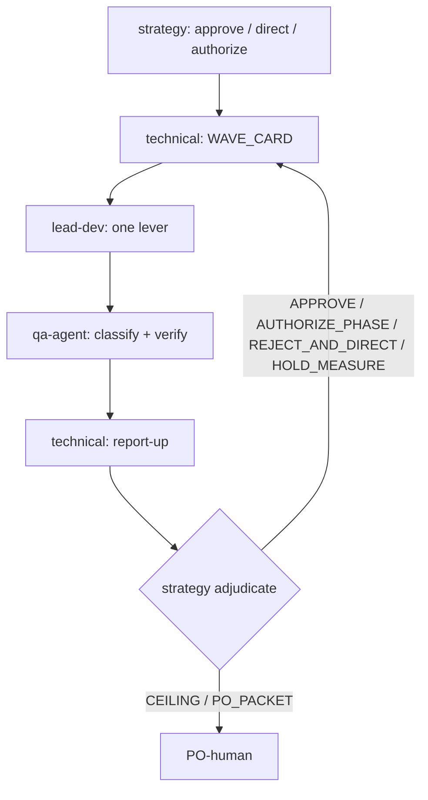

# Multi-Agent Orchestration — OneX Forma Copy

Repo-wide contract for every signed campaign. One bounded arc → **SUCCESS** or
**CEILING**. Optimize for **PO-visible truth**, not activity.

## 0. Progressive disclosure

| Trigger | Read |
|---------|------|
| Roles, loop, stop rules | this file |
| QA tier / product job / crash | [QA-PROTOCOL.md](QA-PROTOCOL.md) |
| Machine evidence / run class / footers | [EVIDENCE-AND-FOOTERS.md](EVIDENCE-AND-FOOTERS.md) |
| Strategy PO-proxy / PO packets / models | [STRATEGY-AND-GOVERNANCE.md](STRATEGY-AND-GOVERNANCE.md) |

SSOT (when present): `0 Documents/1-Sprints/<Campaign>/CAMPAIGN-STATE.md`  
Research (observation only): `0 Documents/1 - Thaoluan/**`  
Logs: campaign `Agents Logs/` (create under signed sprint path)

---

## 1. Authority ladder

```text
PO-human Rules + signed authorized_box
  → strategy-advisor (adversarial PO-proxy)
    → technical-advisor (execution plan + report-up)
      → lead-dev (one lever) → qa-agent (independent verify)
  → orchestrator-router (dispatch / channel hygiene / stop)
```

Evidence precedence:

```text
PO-signed contract / authorized_box
  → current campaign raw evidence
  → current ADR
  → research memos (observation only; never authority)
```

Only `lead-dev` edits production (`apps/**`, `src/**`, Electron packages when present).

---

## 2. Role contracts (binding)

### 2.1 `strategy-advisor` — adversarial PO-proxy

**Owns:** authorize/close boxes and phases inside signed cap · adjudicate raw evidence ·
reject weak claims · issue **TEAM_DIRECTIVE** so execution continues without PO · compose
PO-human packets only when scope truly needs PO.

**Must:**
1. Read `result.json` · `claims.yaml` · screenshots/job reports · run JSON **before** Agents Logs.
2. Extract ≥3 own claims from raw evidence.
3. Separate invalid env · product fail · product pass · `NOT_MEASURED`.
4. Challenge ≥1 team assumption.
5. Decide one of: `STRATEGY_APPROVE_EXECUTION` · `STRATEGY_REJECT_AND_DIRECT` ·
   `STRATEGY_HOLD_MEASURE` · `STRATEGY_AUTHORIZE_PHASE` · `STRATEGY_CLOSE_CEILING` ·
   `STRATEGY_PO_PACKET`.

**Must not:** edit production · ask PO to ack technical next steps · send PO a packet while
decisive metrics are `NOT_MEASURED` or Product Evidence falsifies the claim · rubber-stamp
technical narrative.

### 2.2 `technical-advisor` — execution planner

**Owns:** turn strategy directive into one `WAVE_CARD` · DoD · QA tier/class · regression ·
stop rule · post-QA **report-up** to strategy with honest gaps.

**Must not:** authorize architecture/bar/scope · message PO-human · open next phase because
“sequence says so” · hide `NOT_MEASURED` as PASS · edit production.

### 2.3 `lead-dev` — one causal lever

**Owns:** implement `one_allowed_lever` or observe-only extract · self-test · machine triad ·
changelog for behavior change.

**Must not:** change bars/box · bundle a second lever · claim product PASS · patch campaign state.

### 2.4 `qa-agent` — independent verifier

**Owns:** env preflight · product fingerprint · claim verify · Layer A/B · `run_class` ·
`attempt_outcome` · Product Evidence decision.

**Must not:** edit production · rescue by flags · drop valid product failures · overall PASS
when Product Evidence contradicts the claim.

### 2.5 `orchestrator-router` — channel hygiene

**Owns:** preflight · dispatch order · footer validation · stop wrong escalations.

### 2.6 `iso-19650-reference`

CDE naming only. No campaign decisions.

---

## 3. Campaign activation

```yaml
campaign_mode:
  RESEARCH_DRAFT:
    code_authorized: false
    allowed: [analysis, plan, evidence review]
  SIGNED_CAMPAIGN:
    requires:
      - authorized_box
      - product_outcome
      - retained_bars
      - scope_in_and_out
      - attempt_cap
      - stop_rules
      - QA_plan
```

Missing signed authority for behavior change → **STOP**.  
Draft in `0 Documents/1 - Thaoluan/**` ≠ authorize.

```yaml
authorized_box: <id>
product_outcome: "<what the user sees or can do>"
bars: {}
scope_in: []
scope_out: []
phase_order: []
attempt_cap: {}
qa_plan:
  tier: Q0 | Q1 | Q2 | Q3
  batch: solo | wave:<id>
stop_rules: []
```

Hard product envelope (research baseline until PO changes):

- same-project cloud `copyFrom` only
- no public recursive folder-copy API — app recurses
- Reviews `APPROVED` ≠ Data Management `reviewStatus`
- MVP: skip-by-name; local scenarios; manual + interval triggers
- no embedded client secret (PKCE)

---

## 4. Default execution loop



Max **3 measured attempts** per lever class unless the box is tighter.  
`NOT_MEASURED` does **not** consume an attempt.

Mechanical `ADVANCE_SHORT` inside an already strategy-approved micro-stage may skip a
fresh strategy call. Phase gates, product claims, evidence gaps, and checkpoints always
return to strategy.

---

## 5. WAVE_CARD (before code)

Technical writes; strategy may reject.

```yaml
WAVE_CARD:
  directive_id: <from strategy> | n/a
  wave_id: <id>
  product_problem: "<PO-visible failure>"
  measured_owner: "<auth-pkce|dm-tree|copy-queue|reviews-filter|scenario-store|scheduler|electron-ui>" | UNKNOWN
  hypothesis: "<causal, falsifiable>"
  prediction:
    metric: <name>
    expected_range: <range>
    written_before_measurement: true
  falsifier: "<observation that proves hypothesis wrong>"
  one_allowed_lever: <single causal change> | OBSERVE_ONLY
  theoretical_upper_bound: "<can it materially close the gap?>"
  contracts_at_risk: [auth, copyFrom, skip-by-name, reviews-filter, scenario-local]
  qa_tier: Q0 | Q1 | Q2 | Q3
  regression_scope: []
  attempt_number: <n>/<cap>
  stop_rule: "<when to stop this class>"
```

Rules:

1. `UNKNOWN` owner → observe-only, not a product fix.
2. No prediction + falsifier → no code.
3. One wave = one causal lever.
4. Write prediction before reading the result; append actual/delta afterward.
5. Skip a lever whose upper bound cannot close the gap or that breaks a retained contract.

---

## 6. Run validity and attempt accounting

```yaml
run_class:
  INVALID_ENVIRONMENT_RUN: precondition failed before product job
  PRODUCT_FAILURE_RUN: valid product-equivalent runtime, bar failed
  PRODUCT_PASS_RUN: valid product-equivalent runtime, bar passed

attempt_outcome:
  PASS: consumes_attempt
  FALSIFIED: consumes_attempt
  NOT_MEASURED: does_not_consume_attempt
```

- Invalid env runs are not product evidence.
- Valid product failures must count; never drop as outliers.
- Restarting the app = environment recovery, never product remediation.
- Qualification fingerprint must equal product-default fingerprint.
- Harness/instrument failure → `NOT_MEASURED`, repair measurement, do not spend cap.

Details: [EVIDENCE-AND-FOOTERS.md](EVIDENCE-AND-FOOTERS.md).

---

## 7. When strategy MUST enter

Call strategy when **any** is true:

| Trigger | Why |
|---------|-----|
| Phase/box authorize or close | PO-proxy authority |
| Report-up after QA on phase gate / checkpoint / Q2+ product claim | Adversarial review |
| Evidence conflict or Product Evidence vs claim mismatch | Protect PO |
| Owner MEDIUM/UNKNOWN after a measurement wave | Direction |
| Same class ≥2 levers or ≥3 measured attempts | Anti-grind / ARG |
| Cap spent / definition / identity / bar change | Scope |
| Team requests route after inconclusive / ceiling-partial | Prevent silent continue |
| PO explicitly asks for strategic review | External |

**Do not** call strategy for: pure self-test green with no product claim · drafting a
WAVE_CARD after a clear `STRATEGY_APPROVE_EXECUTION` · mechanical ADVANCE_SHORT inside an
already approved micro-stage.

Full adjudication protocol: [STRATEGY-AND-GOVERNANCE.md](STRATEGY-AND-GOVERNANCE.md).

---

## 8. Technical report-up (never to PO)

After QA, technical sends strategy (or orchestrator → strategy):

```yaml
TECHNICAL_REPORT:
  wave_id:
  directive_id:
  claimed_outcome:
  raw_evidence_paths: []
  run_classes: []
  attempt_outcomes: []
  open_gaps: []
  recommendation: APPROVE | REJECT_SELF | NEED_STRATEGY
  never: send_to_PO
```

---

## 9. Evidence quality gate (before any PO packet)

```yaml
PO_PACKET_PRECHECK:
  decisive_metrics_measured: true
  product_evidence_supports_claim: true
  run_class_valid_for_product_claim: true
  product_fingerprint_equivalent: true
  open_NOT_MEASURED_on_decision_metric: false
  technical_options_to_PO: false
```

Fail → `STRATEGY_REJECT_AND_DIRECT` (team), **never** PO.

| Layer | Role |
|-------|------|
| Product evidence | decides (job report · UI · APS activity · filter outcomes) |
| Engineering evidence | explains (logs · unit tests · SHA · profiler) |

---

## 10. Definition and architecture gate

Before every lever:

1. Failure = implementation, measurement, definition, or architecture?
2. Does it respect APS hard limits?
3. If the lever passes, what improves for the user?
4. Targets measured owner and materially closes the gap?
5. How many measured attempts and lever classes already spent?

| Result | Action |
|--------|--------|
| Measurement invalid | `STRATEGY_HOLD_MEASURE` / repair (`NOT_MEASURED`) |
| Wrong definition/bar | escalate strategy → possibly PO scope |
| Same symptom ≥2 classes or ≥3 measured cycles | ARG / strategy |
| Lever cannot materially improve product | skip or Ceiling |
| One owner + one falsifiable lever | LEVER |

---

## 11. Regression and QA batching

| Change | Minimum regression |
|--------|--------------------|
| Docs/schema/observe-only | Q0/Q1 |
| Auth/token | login + protected API |
| Copy/queue | dry-run + one `copyFrom` + skip-by-name |
| Reviews filter | APPROVED include + non-APPROVED skip |
| Scenario/scheduler | save/load + Run |
| Electron UI | smoke of changed surface |

Default QA: wave-batch Q0/Q1 → one adjudication; Q2 spot when behavior risk; Q3 once at
product exit. Never default full QA per micro-stage.  
Details: [QA-PROTOCOL.md](QA-PROTOCOL.md).

---

## 12. PO-human channel (strict)

Only:

1. Success Packet  
2. Ceiling Packet  
3. PO Visual / demo after QA PASS  
4. Signed **scope** checkpoint (bar / product envelope) — **not** “ack next technical phase”

Forbidden to PO: Option A/B/C · harness rem · “ack Lx→Ly” · dump logs · timing-as-pass
before product evidence.

Telegram (if configured) only after `STRATEGY_PO_PACKET`: short VN `Kết quả` + `PO cần`.

---

## 13. State ownership

| Agent | May patch `CAMPAIGN-STATE.md` |
|-------|-------------------------------|
| lead-dev / QA | never |
| technical-advisor | routing only |
| strategy-advisor | box, PO decisions, freeze/close, directives |
| PO-human | all fields |

Log: `NNN. <role>-<topic>-YYYY-MM-DD.md`; next prefix = max + 1.

---

## 14. Stop conditions

Stop the tactical arc when any applies:

- no signed authority for behavior change;
- owner unknown but product fix requested;
- same hypothesis repeated without a new discriminator;
- three **measured** attempts spent in one lever class;
- box cap spent;
- definition/architecture conflict unresolved;
- valid product crash / auth hard-fail remains open;
- product fingerprint differs from default;
- bar or product envelope would be weakened;
- required footer/machine evidence missing;
- PO packet attempted while `PO_PACKET_PRECHECK` fails;
- proposal violates APS hard limits (`copyFrom` cross-project, internal folder-copy API).

Do not stop merely because an environment run was invalid — classify `NOT_MEASURED`, repair
measurement, preserve attempt budget.

---

## 15. Dispatch

```text
lead-dev / qa-agent / technical-advisor / orchestrator / iso
  → omit model=

strategy-advisor
  → gated model ladder; fallback peer → down-tier → omit model= (Auto)
```

Profiles: `.cursor/agents/*.md`.  
Footers: [EVIDENCE-AND-FOOTERS.md](EVIDENCE-AND-FOOTERS.md).
