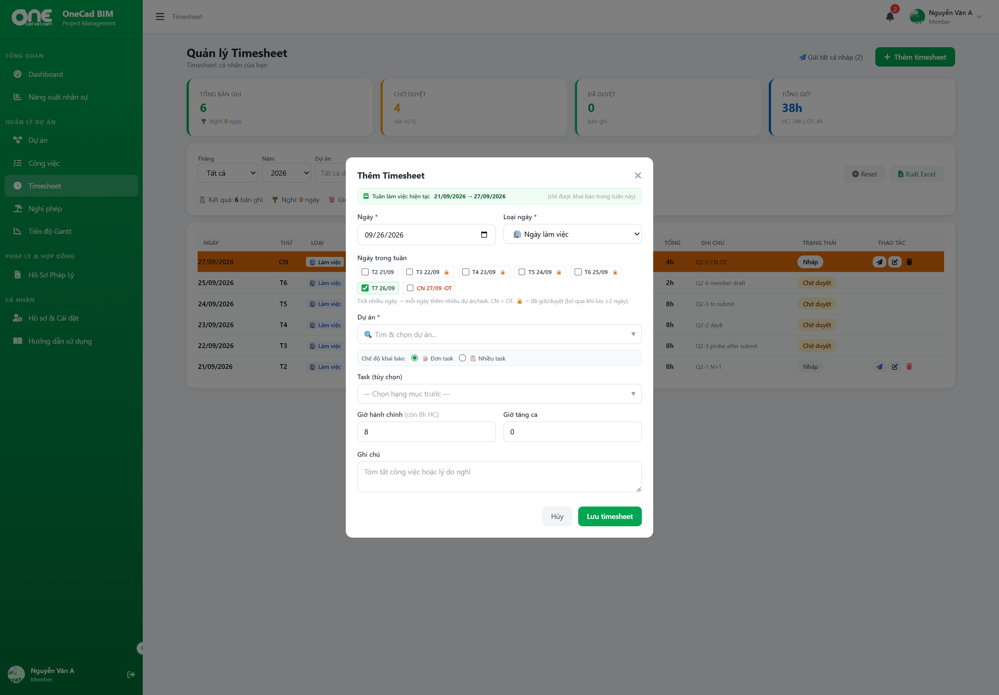

# Q2 product spot — Timesheet Week Copy W1 + W2 (2026-09-26)

**Scope:** `PRODUCT_SPOT` (local preview + authenticated API + browser UI). Not vitest. Not PO packet.

| Field | Value |
|-------|--------|
| Git SHA | `5ebbc83855fb7f1848f2ec4ab14bddd2ca332cb6` |
| Runtime | `http://127.0.0.1:8788` (preview:local, D1 local) |
| Harness | `node scripts/qa-timesheet-week-copy-q2.mjs` |
| Users | `nguyen.van.a` / `Bim@2024` (member), `le.van.c` / `Bim@2024` (PL) |
| Week under test | 2026-09-21 (T2) … 2026-09-27 (CN) |

## attempt_outcome (yaml)

```yaml
Q2-1:
  outcome: PASS
  scope: PRODUCT_SPOT
  detail: POST /api/timesheets N=1 → 201 draft id=21 work_date=2026-09-21

Q2-2:
  outcome: PASS_PARTIAL
  scope: PRODUCT_SPOT
  detail: Sequential POST multi-day 2026-09-22 + 2026-09-23 → both accepted
  not_measured: multi-project same day (seed has project_count=1 PRJ001 only)

Q2-3:
  outcome: PASS
  scope: PRODUCT_SPOT
  detail: After submit, GET narrow map lists submitted; skip-map keys skip=true for submitted rows; status stays submitted|approved after re-POST
  engineering_note: N≥2 batch uses _tsWeekCopyShouldSkip (client). Direct N=1 POST still create-or-update (200 action=updated) on submitted row — does not downgrade status; content may update (backend allows non-approved existing)

Q2-5:
  outcome: PASS
  scope: PRODUCT_SPOT
  detail: Sunday 2026-09-27 POST regular_hours=0 overtime_hours=4 → 201, no ot_requires_hc

Q2-6:
  outcome: PASS
  scope: PRODUCT_SPOT
  detail: bulkSubmitDraftTimesheets uses user_id=currentUser.id; PL GET draft?user_id=PL does not list member draft; UI count ownDraftCount filters user_id===currentUser.id
  engineering_note: PL single PUT status=submitted on member draft id still 200 (proj-admin path) — bulk button logic remains own-only

W2-GET:
  outcome: PASS
  scope: PRODUCT_SPOT
  detail: GET /api/timesheets?limit=200&year&month&user_id builds map; locked rows this month=4

W2-UI:
  outcome: PASS
  scope: PRODUCT_SPOT
  detail: Browser login (token inject) → openTimesheetModal → _refreshTsWeekSkipHints; 4× checkbox 🔒 badges (data-ts-locked-badge); map size 6; screenshot q2-week-copy-ui-badges-2026-09-26.png

overall: PRODUCT_PASS_RUN
overall_caveats:
  - Q2-2 multi-project same day NOT_MEASURED (fixture)
  - Q2-3 N=1 POST upsert on submitted documented; week-copy skip path measured via map + UI
```

## Script summary (2026-09-26 run)

```
[PASS] Q2-1: created draft id=21 date=2026-09-21
[PASS] Q2-5: Sunday 2026-09-27 OT=4 HC=0 accepted id=20
[PASS] Q2-2: sequential POST 2026-09-22+2026-09-23 ok
[PASS] Q2-3: id=22 locked=submitted after re-POST 200 action=updated; skip-map source OK
[PASS] Q2-6: bulk own-filter OK (no leak); PL single PUT can submit member draft (UI bulk still own-only)
[PASS] W2-GET: narrow GET ok; locked rows this month=4
OVERALL: PRODUCT_PASS_RUN (API Layer B)
```

## UI evidence (W2)



Legend in modal: `🔒 = đã gửi/duyệt (bỏ qua khi lưu ≥2 ngày)`. Checkbox row shows 🔒 on T2–T6 when map has submitted/approved for that week.

## Code anchors (static, for W2 path)

- `_fetchTimesheetsForWeekSkip` → GET hẹp theo tháng
- `_refreshTsWeekSkipHints` / `_annotateTsWeekLockedBadges` in `public/static/app.js`
- Batch submit loop skips via `_tsWeekCopyShouldSkip` when N≥2

## Regenerate

```bash
npm run preview:local   # if :8788 down
npm run db:seed:test    # optional reset
node scripts/qa-timesheet-week-copy-q2.mjs
```

Browser: open `http://127.0.0.1:8788`, login member, **+ Thêm timesheet** — week row should show 🔒 after GET hints load.
